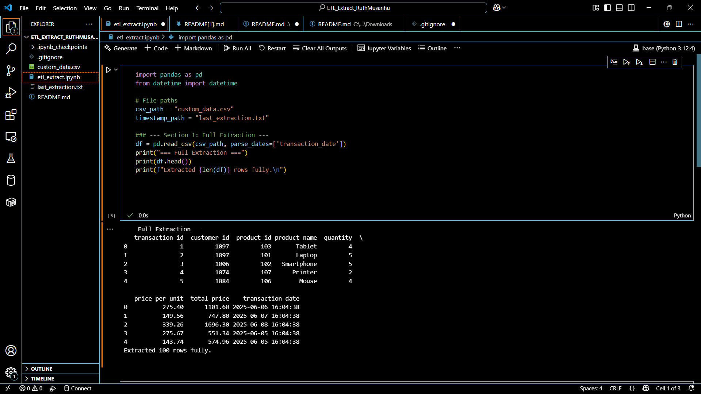
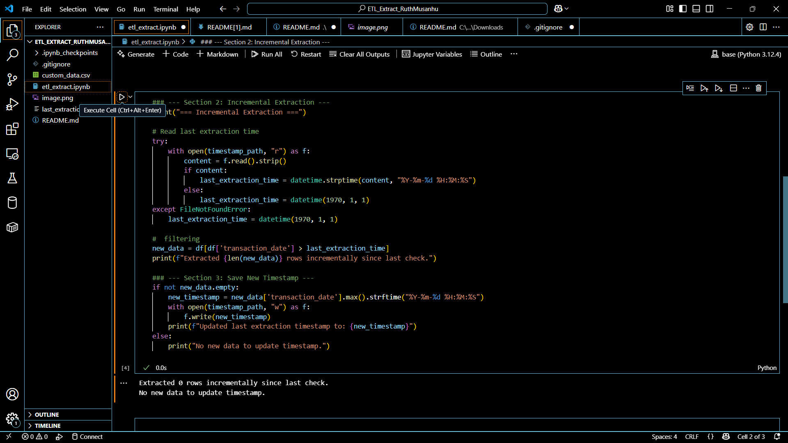
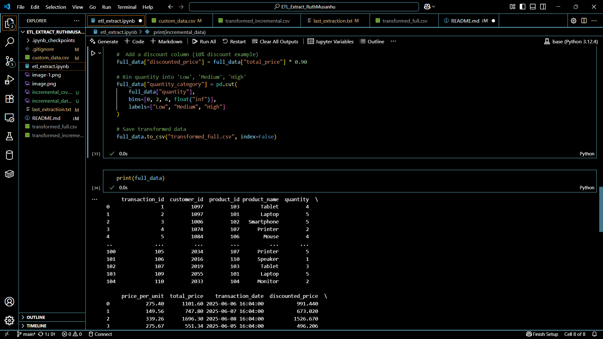
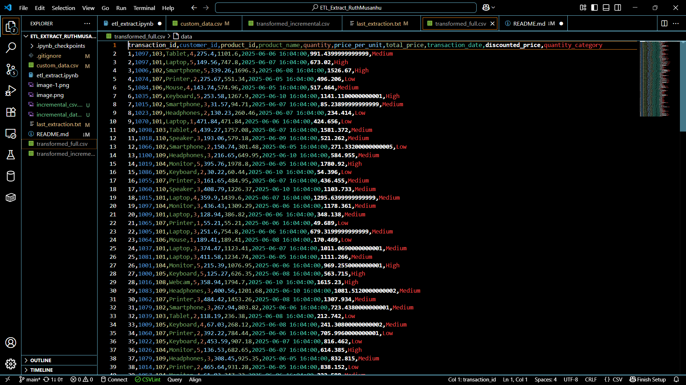
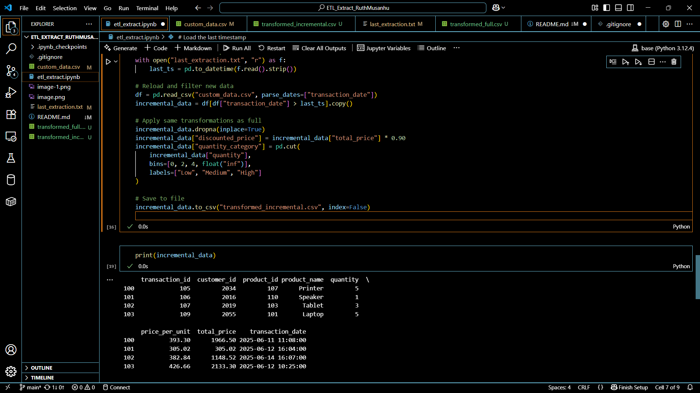
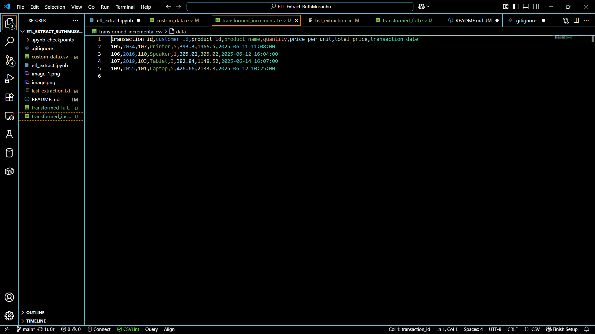

**Student Name**: Ruth Musanhu
**Student ID**: 670474 
**Submission Date**: [10th june 2025]

## 📌 Project Overview
The project is a practical demonsration of Extract-Transform-Load (ETL) operations focusing on **full** and **incremental** data extraction patterns.It was developed using Python within a Jupyter Notebook environment, it processes synthetic sales transaction data to simulate a real-world data pipeline scenario.

## 🛠️ Tools & Technologies
- **Python 3**
- **Pandas** for Data manipulation
- **Jupyter Notebook** for Interactive development
- **Git/GitHub** for Version control

## 📂 Project Structure
ETL_Extract_ruthmusanhu
├── etl_extract.ipynb         # Your Jupyter notebook containing ETL logic
├── custom_data.csv           # The chosen/generated sales dataset
├── last_extraction.txt       # Stores the timestamp for incremental extraction
├── .gitignore                # Excludes unneeded files from version control
├── README.md                 # This project explanation file
├── image.png               # Screenshot: Full Extraction Output
├── image-1.png               # Screenshot: Incremental Extraction Output
└── README.pdf                # PDF version of the README (if applicable)

## Dataset Origin
The dataset `custom_data.csv` is synthetically generated and contains 100 sales records with timestamps.

## 🧩 Key Features
1. **Full Extraction**:
Full Extraction is the process of extracting all data from the source system every time the ETL process runs. It does not consider whether the data has changed or not.In this case the  notebook displays key statistics like the total number of rows and columns, along with a sample of the loaded data,confirming a successful full extraction.

2. **Incremental Extraction**
Incremental Extraction retrieves only the new or changed data since the last extraction. It uses a mechanism such as timestamps, log files, or change data capture (CDC) to identify what has changed. This method is more efficient for large datasets as it minimizes data movement and processing

3. **Save timestamp**
Updates the timestamp after successful extraction.

## How to Reproduce
1. Open `etl_extract.ipynb` in Jupyter Notebook.
2. Run all cells in order.
3. Ensure `custom_data.csv` and `last_extraction.txt` are in the same directory.

## LAB 4

## 📘 Overview  
This project adds on the previous project with two more CSVs being added (transformed_full.csv and transformed_incremental.csv). Its objectives were to build and enhance an ETL (Extract, Transform, Load) pipeline that can extract data from a CSV file using both full and incremental extraction methods, apply multiple data transformation techniques to clean, enrich, and categorize the data, and output structured datasets ready for analysis.

## 🔄 ETL Flow

### 1. **Full Extraction**
This involved reading the entire dataset. From there some transformations were applied to the dataset. The transformations done include cleaning of missing values, enrichment by adding a new column (discounted price) and then cartegorizing the data. The results were then saved to the transformed_full.csv.

### 2. **Incremental Extraction**
This filters the records for records newer than 'last_extraction.txt'. The same transformations as in full extraction are also applied. The 'last_extraction.txt' is updated after each run. The results were saved in the tranformed_incremental.csv file

## 🔧 Transformations Applied

✅ **Cleaning:**  
- Dropped rows with missing values.

✅ **Enrichment:**  
- Added a `discounted_price` column (10% discount on `total_price`).

✅ **Categorization:**  
- Grouped `quantity` into 3 bins: Low (0–2), Medium (2–4), High (>4).

## 📁 How to Run

1. Ensure `custom_data.csv` and `last_extraction.txt` exist.
2. Open and run `etl_extract.ipynb` in Jupyter Notebook.
3. Check generated outputs:
   - `transformed_full.csv`
   - `transformed_incremental.csv`

---

## 🧾 Notes
- Add new rows with a later `transaction_date` in `custom_data.csv` to test incremental logic.
- Timestamp format in `last_extraction.txt`: `YYYY-MM-DD HH:MM:SS`

